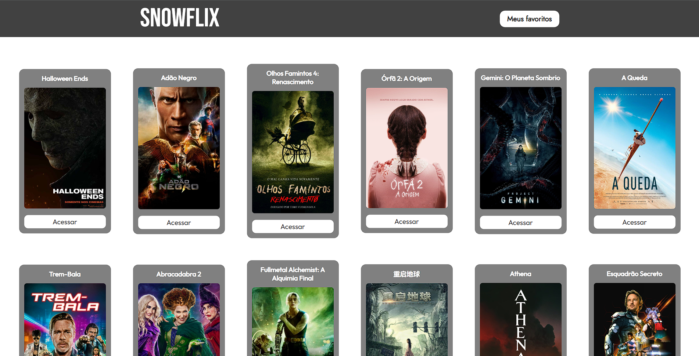
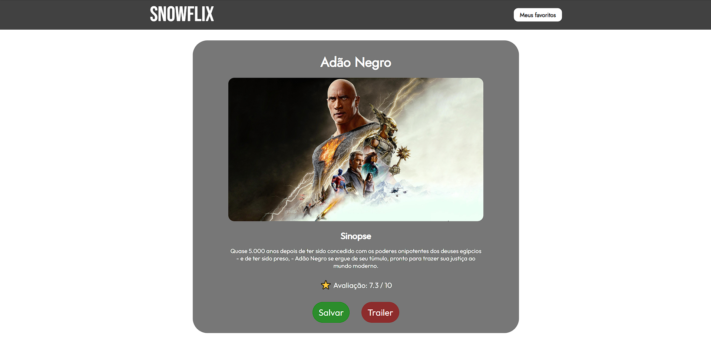
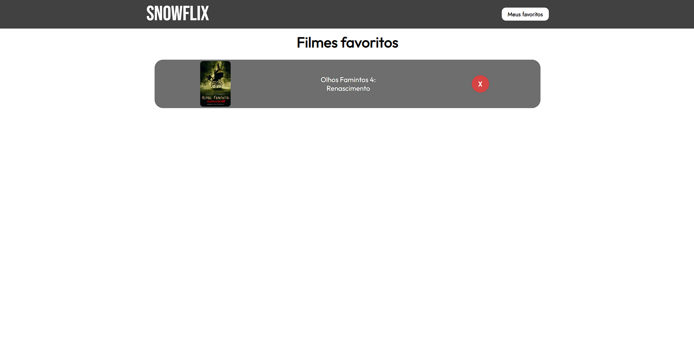
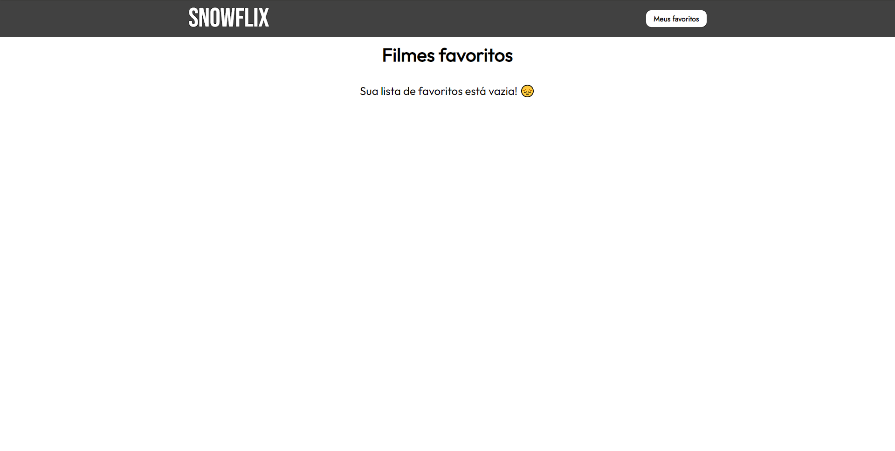
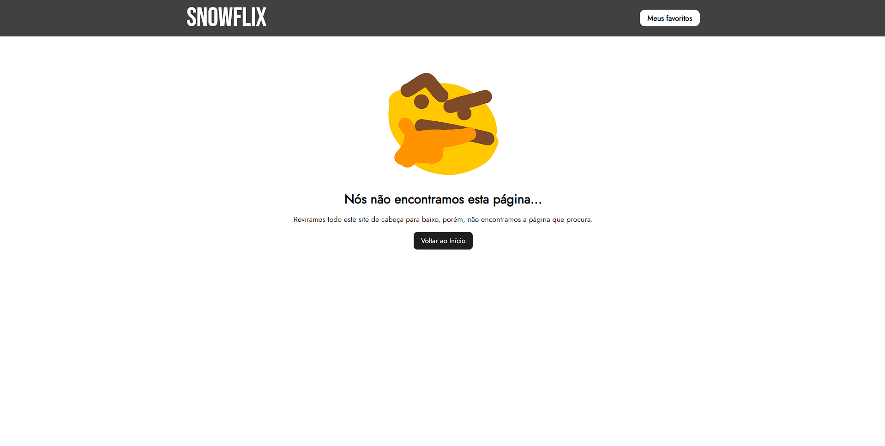

   

&nbsp;
## THE SNOWFLIX:
---

   The Snowflix is a project I have developed that can show the movies are playing now or in the theaters. At the moment, in the snowflix people can see some information about these movies like the synopsis or the rating about it and save it if they want.

&nbsp;
## ABOUT THE PROJECT:
---

   This is my first project using React, in this sense the objective was to apply my knowledge about React, React Hooks, React Routes (using react-router-dom), Vite JS, AXIOS for the HTTP requests and React Toastify for the alert styles. The user can save the movies but, for now, these movies only stays on the browser's local storage, so at the moment there is no database. I decided to deploy this project on the netlify that people can access by clicking on the logo image at the top of this README.

&nbsp;
## TECH STACK:
---

   &nbsp;
   &nbsp;
   &nbsp;
   &nbsp;

&nbsp;
## OTHERS:
---

### Netlify Status: 

&nbsp;
### IMAGES: 
---

#### - Main content:

&nbsp;
#### - Movie information:

&nbsp;
#### - Favorite list:

&nbsp;
#### - Favorite list empty:

&nbsp;
#### - 404 not found page:

